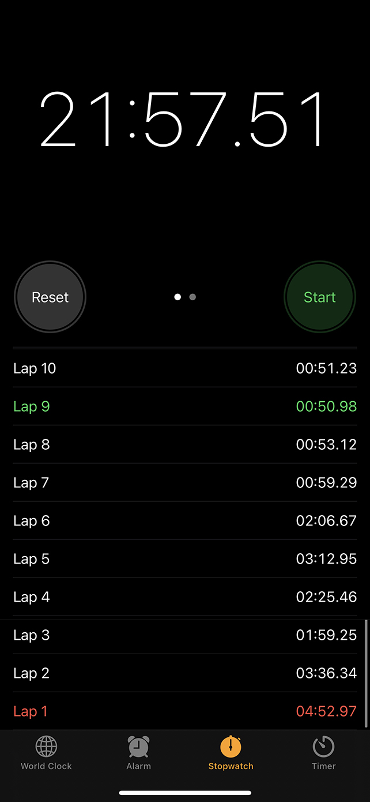
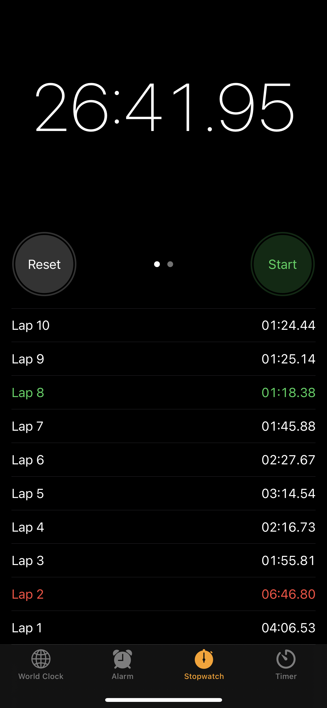

# Homework 1

## Arrays

[Add one to number](https://leetcode.com/problems/plus-one/) | [My solution](arrays/plus-one.js)

[Wave array](https://www.interviewbit.com/problems/wave-array/) | [My solution](arrays/wave-array.js)

[First missing integer](https://www.interviewbit.com/problems/first-missing-integer/) | [My solution](arrays/first-missing-integer.js)

<https://www.interviewbit.com/problems/hotel-bookings-possible/>

<https://www.interviewbit.com/problems/partition-list/>

[Remove duplicates from sorted list](https://leetcode.com/problems/remove-duplicates-from-sorted-list/) | [My Solution](arrays/remove-duplicates-from-sorted-list.js)

[Merge two sorted lists](https://leetcode.com/problems/merge-two-sorted-lists/) | [My Solution](arrays/merge-two-sorted-lists.js)

## Patterns

**Sliding window**:

<https://leetcode.com/problems/longest-substring-without-repeating-characters/>
<https://leetcode.com/problems/longest-substring-with-at-most-two-distinct-characters/>
<https://leetcode.com/problems/subarray-product-less-than-k/>

**Closing window (2 pointers)**:

<https://leetcode.com/problems/3sum/>
<https://leetcode.com/problems/4sum/>
<https://leetcode.com/problems/trapping-rain-water>

## Maximum Sum Subarray

<https://www.interviewbit.com/problems/flip/>
<https://www.interviewbit.com/problems/max-sum-contiguous-subarray/>

Sum subarray = k
<https://leetcode.com/problems/maximum-size-subarray-sum-equals-k/>

## Monotonic Queue

<https://leetcode.com/problems/next-greater-element-i/>
<https://leetcode.com/problems/largest-rectangle-in-histogram/>

## Bucketing (a.k.a. Counting Sort)

[Top k frequent words](https://leetcode.com/problems/top-k-frequent-words/) | [My Solution](bucketing-count-sort/top-k-frequent-words.js)
